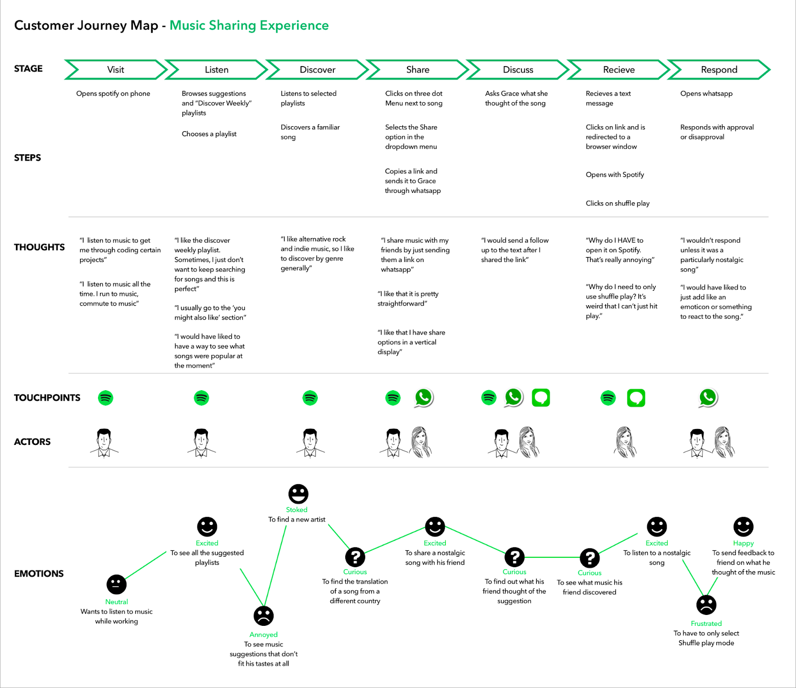

# Web CX Strategy and Vision: Customer Journey Map

A well-defined Web Customer Experience (CX) strategy is crucial for creating meaningful, user-centered interactions across digital touchpoints. Using a customer journey map is an effective way to visualize each step of the customer’s digital experience, from first engagement to post-interaction, helping to identify friction points, optimize the user journey, and ensure alignment with the overall CX vision.

## Steps to Establish a Web CX Strategy and Vision

### Customer Journey Map Diagram

*Figure: Example of a Web Customer Journey Map.*

The diagram above illustrates the main stages and digital touchpoints in a typical web customer journey. This journey can help teams understand where users interact with the site, what actions they take, and the emotions they experience at each point.

### 1. Define Web CX Vision

A clear Web CX vision aligns all digital interactions with the desired perception of your brand. This vision guides how users engage with your online channels, setting expectations and shaping the overall experience.

- **Set Core Web Principles**: Identify key principles for your digital experience, such as "User Empowerment," "Ease of Access," or "Trust and Security."
- **Align with Brand Identity**: Ensure the CX vision for the web aligns seamlessly with your overall brand identity, fostering consistency across physical and digital touchpoints.

### 2. Map Out Key Stages of the Digital Journey

Identify each stage of the customer journey that takes place on the web. Common stages might include:

1. **Awareness**: Users discover your brand through search engines, social media, or ads.
2. **Consideration**: Potential customers explore the website, review content, and evaluate if the service meets their needs.
3. **Conversion**: Users make decisions or take actions, such as signing up, purchasing, or requesting a demo.
4. **Retention**: Post-interaction, users revisit the site for support, upgrades, or content that keeps them engaged.
5. **Advocacy**: Loyal users share positive feedback, testimonials, or referrals, contributing to brand growth.

### 3. Identify Key Touchpoints and Pain Points

Each stage of the digital journey has touchpoints where users interact with the site or application. Mapping these touchpoints enables you to pinpoint areas for improvement and identify friction points.

- **Key Digital Touchpoints**: Home page, landing pages, product pages, sign-up forms, help center, etc.
- **Common Pain Points**: Long load times, difficult navigation, unclear calls-to-action (CTAs), lack of mobile responsiveness, and more.

### 4. Set Goals and Metrics for Success

To measure the effectiveness of your Web CX strategy, define clear goals and metrics aligned with each stage and touchpoint of the journey.

- **Awareness**: Measure brand visibility with metrics like page views, time on page, and bounce rate.
- **Consideration**: Track engagement metrics like clicks, downloads, and form completions.
- **Conversion**: Monitor conversion rates, cart abandonment, and successful purchases.
- **Retention**: Look at return visits, customer satisfaction scores, and repeat purchase rates.
- **Advocacy**: Track reviews, referral traffic, and social media mentions.

### 5. Continuously Optimize the Web CX Strategy

Customer needs and expectations evolve, so it’s crucial to continually revisit and refine your Web CX strategy.

- **User Feedback**: Collect ongoing feedback through surveys, usability testing, and customer support insights.
- **Analytics**: Use data from tools like Google Analytics to monitor changes in user behavior and identify new opportunities for optimization.
- **A/B Testing**: Test variations of critical elements like CTAs, layouts, and navigation structures to maximize engagement and conversions.

## Summary

A customer journey map is essential for crafting a Web CX strategy that resonates with users and supports business goals. By understanding each stage of the web customer journey, defining clear objectives, and measuring outcomes, organizations can create a seamless, enjoyable, and effective digital experience that builds loyalty and drives growth.
