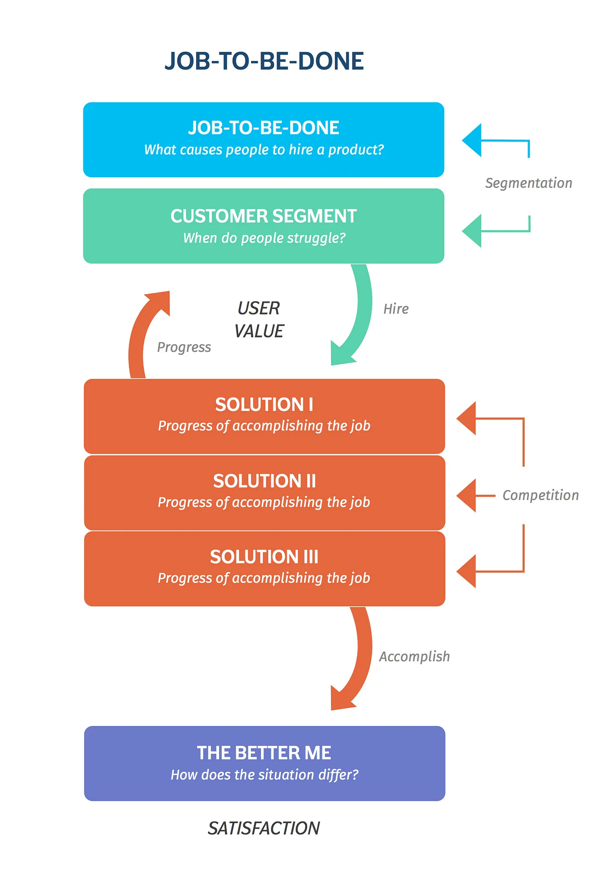
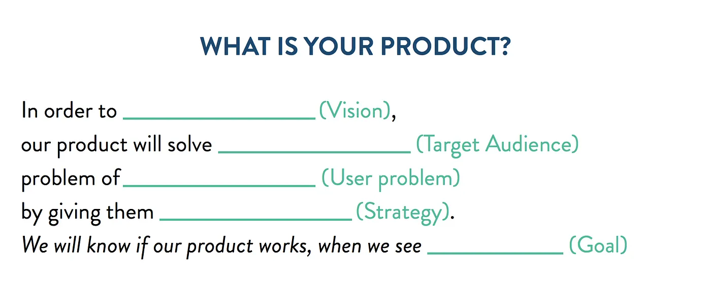

# Product Thinking

Product thinking is an approach that puts the user at the center of the product development process. It guides teams to focus on understanding and solving user problems, defining a clear vision, and delivering measurable outcomes. This method helps ensure that a product aligns with user needs and drives business goals.

## Key Components of Product Thinking

### 1. User First

Understanding the user's needs and challenges is the foundation of product thinking. Before jumping into development, a deep understanding of the problem and the target audience is essential.

- **Problems**: What problem are we solving?
  - Identify the core problems that the product aims to address. This helps align the team's efforts toward delivering real value to users.

- **Target Audience**: For whom are we doing this?
  - Define the specific audience segments that will benefit from the solution. Knowing who the product is for allows for tailored features and messaging.

#### Problem-Solution Fit
Once the problem and audience are clearly defined, it's crucial to validate that the solution effectively addresses these issues. This step helps to ensure that the product will genuinely meet user needs.

### 2. Job-To-Be-Done

With a clear understanding of the user's needs, the next step is to define the product’s purpose and strategy.

- **Vision**: Why are we doing this?
  - Establish a vision that explains the purpose behind the product. This serves as a guiding principle, aligning all stakeholders around a shared objective.

- **Strategy**: How are we doing this?
  - Develop a strategy outlining the approach to achieve the vision. This includes the technical and design choices that will bring the product to life, ensuring it's effective and scalable.

  

### 3. Output

The output stage translates strategy into actionable goals and features. These are the elements that users will interact with and experience.

- **Goals**: What do we want to achieve?
  - Set clear, measurable goals that represent the desired outcomes. Goals provide direction and a benchmark to assess the product’s success.

- **Features**: What are we doing?
  - Define the features that will make up the product. Features should directly support the vision, solve user problems, and contribute to achieving goals.

#### Measuring Success
Measuring success involves evaluating how well the product achieves its goals and fulfills user needs. This may include user feedback, analytics, and other key performance indicators (KPIs) that reflect the impact of the product.

---

By following this structured approach, teams can ensure they are building a product that not only meets user needs but also aligns with the company's vision and strategic goals.
